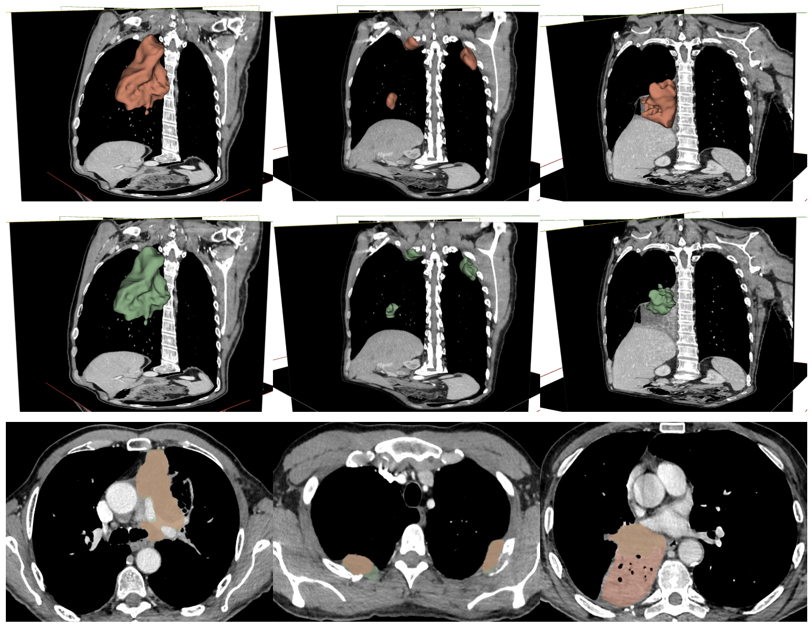

# Trustworthy AI for stage IV non-small cell lung cancer: automatic segmentation and uncertainty quantification

This repository is the official implementation of **Trustworthy AI for stage IV non-small cell lung cancer: automatic segmentation and uncertainty quantification**. 

## Training

To train the model(s) on your dataset, run `main.py` and specify arguments by reading the parser in `config.py`, especially `job_mode=train`. Images and ground-truth masks have to be at the NRRD format and you need to prepare a .csv file with one line per image containing a string to identify each patient ('patient_id'), the absolute path to the image file ('img_path'), the absolute path to the mask file ('mask_tum') and a list of 6 indexes to identify the bounding box that crop around the lung ('bounding_boxes'). 

## Evaluation

To evaluate my model on ImageNet, run `main.py` and specify arguments by reading the parser in `config.py`, especially `job_mode=evaluate`. Metrics will be saved as a .csv in `outputs` folder.

## Results

